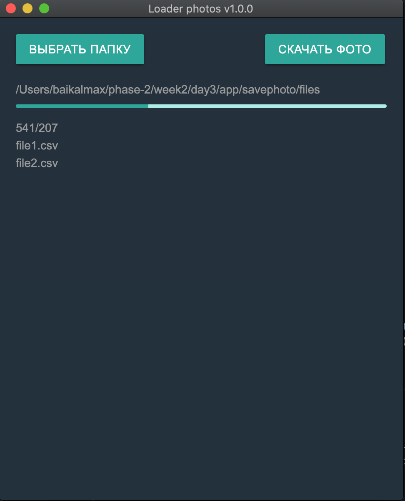

<h1> <strong> ELECTRON APP </strong> </h1> 
  <h3>Application for loading files</h3>
   v 1.0

<pre>
Приложение позволяет выбрать файлы на локальном диске копьютера с расширением 'cvs',
для каждого файла создать папку с именем, как название файла, 
спарсить пул ссылок на фотографии в интернет и загрузить их в эту папку 

</pre>

<h4> <strong> Что это? </strong></h4>

Десктопное приложение для скачивания фото по ссылкам из файлов БД.

<h4> <strong> Зачем? </strong></h4>

Автоматизировать работу администратора интернет магазина

<h4> <strong> Какие технологии использовали? </strong> </h4>

<h4> Electron </h4>
<h4> Node </h4>
<h4> JS, HTML, CSS </h4>

<h4> <strong> Как запустить ? </strong></h4>
<ul>
<li> Клонируйте репозиторий на свой компьютер </li>
<li> Воспользуйтесь командой: </li>
     
    
npm i 

  
npm start 

  <li> Для компиляции десктопного приложения используйте команду <b> npm run dist</b> </li>
</ul>

  

